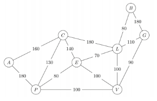

# DIJKSTRA's Alhorithme

## Undirected Graph

#### <u>*Example 1*</u>


*Output*

```text
0    Path: '0'    Cost: 0
1    Path: '0 -> 1'    Cost: 4
2    Path: '0 -> 1 -> 2'    Cost: 12
3    Path: '0 -> 1 -> 2 -> 3'    Cost: 19
4    Path: '0 -> 7 -> 6 -> 5 -> 4'    Cost: 21
5    Path: '0 -> 7 -> 6 -> 5'    Cost: 11
6    Path: '0 -> 7 -> 6'    Cost: 9
7    Path: '0 -> 7'    Cost: 8
8    Path: '0 -> 1 -> 2 -> 8'    Cost: 14
```

#### <u>*Example 2*</u>



*Output*

```text
P	Path: 'B -> L -> E -> P'	Cost: 230
A	Path: 'B -> L -> E -> P -> A'	Cost: 410
B	Path: 'B'	Cost: 0
C	Path: 'B -> L -> C'	Cost: 260
E	Path: 'B -> L -> E'	Cost: 150
V	Path: 'B -> L -> V'	Cost: 180
G	Path: 'B -> G'	Cost: 180
L	Path: 'B -> L'	Cost: 80
```